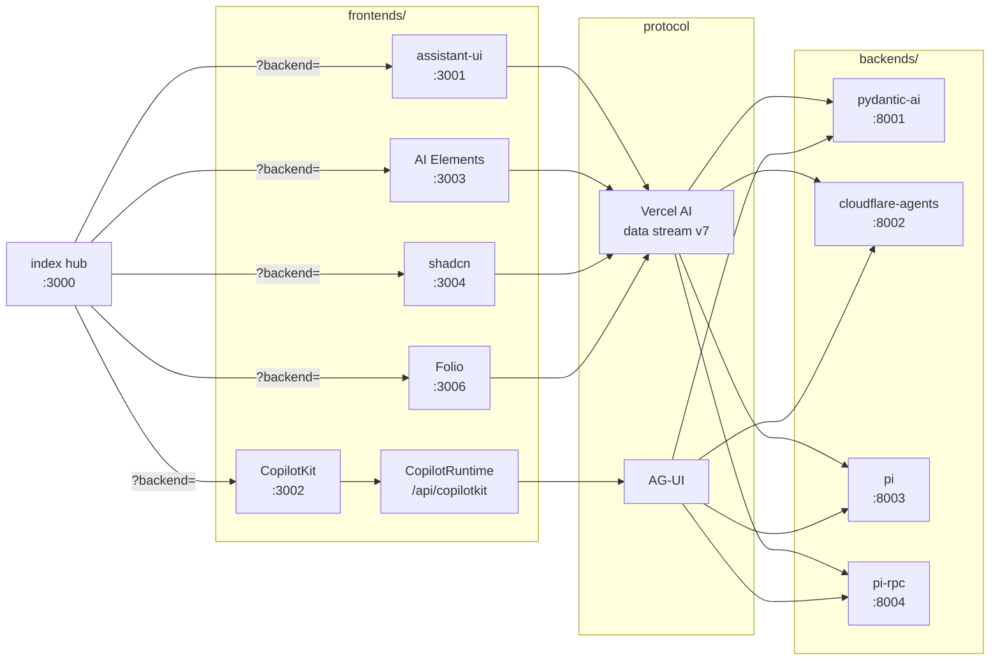
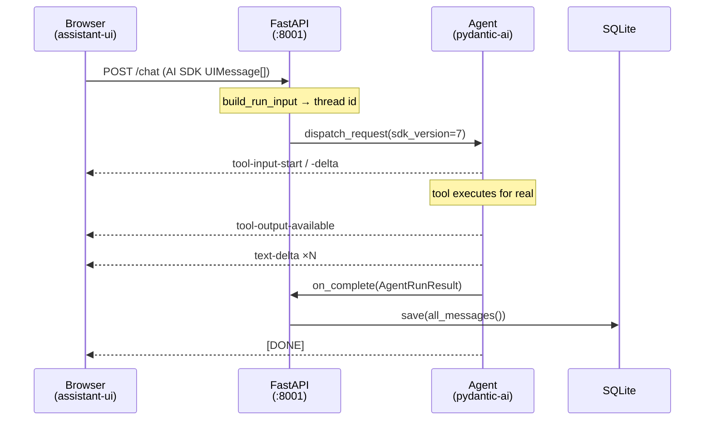

# Architecture

## What this is for

This repo exists to answer a question that documentation can't: which chat UI and
which agent backend do you actually want to work with? That question only has a
meaningful answer if the things being compared are doing identical work, and the
whole architecture follows from taking that requirement seriously.

The temptation with a demo like this is to build one app per combination. That
gets you working demos and no comparison — each one drifts, each one is a
slightly different agent, and by the third you're comparing your own
implementation choices rather than the libraries. So instead of stacks, this
repo is organised around **axes**: independent variables you can change one at a
time while everything else is pinned.

## The axes

There are three axes and one control variable.

**Frontend** and **backend** are separate processes that never share a runtime.
The **protocol** between them is a third axis rather than a property of either
end, because a backend can serve several protocols at once — the pydantic-ai
backend already serves two, and that turned out to be one line of difference.

The control variable is the **model**. It defaults to a deterministic scripted
one rather than a provider, so two frontends given the same prompt receive
byte-identical work to render. A real model would make every run different,
which is precisely wrong when the thing under test is rendering. The tools still
execute for real — only the model's choices are scripted — and `DEMO_MODEL`
swaps in a real provider when you want to see genuine tool selection instead.

Five cells and four backends are live — twenty squares — plus one cell outside
the grid entirely, further down. The hub's picker chooses the backend and every
cell reaches any of them.

The asymmetry in that diagram is worth reading carefully. Four of the five
frontends speak their protocol from the browser, so the arrow goes straight to
Python. CopilotKit requires a **server-side runtime** in its own Next process, so
the browser talks to that and the runtime talks AG-UI onward. Both are legitimate
designs — the hop is a natural home for auth and rate limiting — but it means
"frontend" isn't uniformly a pure client.

That asymmetry resurfaces in backend switching. The hub passes the chosen backend
to a cell as `?backend=`, which the four direct cells read in the browser. In
CopilotKit the hop that talks to the backend runs server-side, so the choice has
to be forwarded: the provider sends it as an `x-demo-backend` header and the
route's per-request agents factory builds the `HttpAgent` for it. Same axis, two
mechanisms, because the topologies genuinely differ.

## How a request actually flows

Taking assistant-ui over the Vercel AI data stream as the representative case —
the same path AI Elements, shadcn and Folio use. Nothing sits between the two: the
browser posts directly to the Python process, which is why swapping backends is a
URL change rather than a redeploy.

The two places worth understanding are the entry and the exit.

On the way in, the request body carries a chat `id` that becomes the thread key.
`VercelAIAdapter.build_run_input` parses the body before `dispatch_request`
consumes it — safe because Starlette caches the body — which is how the same
request serves both routing and the run.

On the way out, `on_complete` receives an `AgentRunResult`, so persistence is
`store.save(thread_id, result.all_messages())`. This fires on stream completion,
which has a consequence worth internalising: a client that disconnects mid-stream
leaves nothing behind. That is a reasonable default, but it means "the request
was made" and "the turn was recorded" are different events.

## The four seams

Four decisions carry the swappability, and each has a cost.

**A reference agent, not just a protocol.** `protocol/CONTRACT.md` specifies three
tools every backend implements: one fast and structured, one returning a list,
one deliberately slow. A shared wire format alone wouldn't be enough, because two
backends could conform to it while giving frontends completely different work to
render. The cost is that adding a backend means implementing the tools, not just
the endpoints.

**Persistence in a neutral format.** The store holds pydantic-ai `ModelMessage`s,
not either wire format. Each adapter's `dump_messages` renders them on the way
out, which is why `GET /threads/{id}?protocol=ag-ui` works without a second store.
Adding a protocol adds a rendering path rather than a migration. The cost is
coupling the store's schema to pydantic-ai's message model — a backend built on
something else keeps its own store and only has to match the HTTP surface.

**Process per stack, no shared runtime.** Every frontend and backend runs
standalone on its own port. There is no shared library they all import, which
means a stack can't accidentally get an advantage from harness code, and a
broken stack can't take the others down. The cost is duplication: each backend
reimplements the same three tools.

**A conformance script as the gate.** `protocol/conformance.sh` asserts the
events a frontend actually depends on — including `tool-input-start` and
`tool-input-delta`, which are what let a UI show arguments arriving rather than
just a spinner. A backend that passes can be driven by any frontend here. This
replaces "run it and see", which is the failure mode where you discover a
protocol gap three frontends later and can't tell which end broke.

## What each directory owns

`protocol/` is the contract and its enforcement, and it is the only thing both
sides are allowed to depend on.

`backends/<name>/` is one agent framework, standalone, owning its own
dependencies and store. `frontends/<name>/` is one chat UI, a pure client with no
model provider dependency — deleting the scaffold's API route is part of onboarding
a frontend, because a UI that owns a model client can't be compared cleanly
against one that doesn't.

`scripts/` is lifecycle. The matrix itself lives in `scripts/stacks.sh` as two
arrays of `name:port`, and every script reads it from there rather than keeping
a second copy, so registering a stack with the lifecycle is one line. The hub
keeps its own richer lists in `index/index.html` — a row needs a blurb and the
protocol it speaks, which a `name:port` can't carry — and `probes/hub.spec.ts`
asserts the two agree.

`index/` is the hub on :3000 — harness furniture rather than a cell, which is why
it is started from `run.sh` instead of being registered in `stacks.sh`. It
serves two hand-written pages beside the grid, [the golden
check](../index/golden.html) and [the monolith](../index/monolith.html), plus a
set of ergonomics-notes pages generated from the stack READMEs at run time and
never committed, so there is one source of truth and one staleness clock.

`probes/` is the flows harness: the axes written as plain-sentence steps, run
against every cell and captured at the same moments so the results sit side by
side. It answers the question conformance can't — not "does this stack work" but
"what did this UI actually do with the same input".

`docs/` is this file, `reflection.md` for what the comparison showed, and
`publishing.md` for the sequence that puts it on the internet. Per-stack
ergonomics notes deliberately live in each stack's own README instead, written
during the build while the friction is still fresh — they are the notes you
reread when deciding, and they age better than recollection does.

## Adding to the matrix

Three shapes of addition, in increasing cost.

**A new frontend** is cheapest: point it at an existing backend's URL, delete
whatever provider client its scaffold shipped with, add a line to `stacks.sh`
and an entry to the `FRONTENDS` list in `index/index.html` so the hub draws its
row. No backend work if it speaks a protocol already served.

**A new protocol** on an existing backend is next. Because `dispatch_request` is
symmetric across adapters, this is close to free on the pydantic-ai backend —
serving AG-UI alongside the AI SDK stream cost one endpoint. Then extend
`conformance.sh` with the events that protocol must emit.

Adding CopilotKit exercised both shapes at once and confirmed the design: the
backend needed **no changes at all**, because `/ag-ui` was already conformant.
The work was entirely in the new frontend, and the one-line registry edit in
`stacks.sh` was genuinely the only place the matrix had to learn about it.

A new frontend also needs a `probes/frontends.ts` adapter so the flows run
against it, and it should read `?backend=` so the hub can point it anywhere.

**A new backend** is the real work: implement the reference agent's three tools,
serve at least one protocol, expose the thread endpoints, and pass conformance.
The `pi` backend was the interesting case, and it landed differently from the
plan: the guess was `pi --mode rpc` — a subprocess and a translated event stream
— but pi's SDK runs in-process under Bun, so it is `createAgentSession` with the
three tools and a scripted `Provider` registered on pi's own `ModelRuntime`. What
stayed true is that pi ships an event stream and no wire format, so the two
protocol adapters (~130 lines each) are this backend's cost, where pydantic-ai
gets them from its library. The events map one-to-one and the adapters are
switch statements — a good sign for pi's event model. The original guess then
landed as its own cell: `pi-rpc` drives `pi --mode rpc` as a child process per
thread, with the same scripted provider and tools loaded into the child as a pi
extension. Its streams are byte-identical to the in-process cell's; the one
thing the process boundary costs is that pi's wire format omits the live
tool-call id, so arguments arrive in a burst rather than streaming. The
research and the rejected alternatives are in `backends/pi-rpc/README.md`.

Whatever the shape, write the ergonomics notes before moving on. That is the
axis with no automated probe, and it is unrecoverable a week later.

**A monolith** is the fourth shape, and it is the one the axes were designed to
avoid: `frontends/jinja` runs the reference agent in the same process that
renders the HTML, so there is no wire between the ends and no `?backend=` to
honour. It's included on purpose, because it answers a question the axes can't
put — what a chat UI costs when nothing in the stack is a chat framework — and
that answer is only worth having if the work underneath is identical, which is
why its `agent.py`, `scripted.py` and `store.py` are copies of the reference
backend's held to them by a `diff`, and why it serves `/chat` and `/ag-ui` so
`conformance.sh` gates it the way it gates a backend. It can be compared on
everything downstream of the event stream: same three tools, same scripted
model, same chunks, rendered into HTML on the server rather than into components
in the browser. It can't be compared on protocol or topology, having one of each
by construction and nowhere else to point. It also does two things none of the
five grid cells do — reload resumes the thread, and there is a thread list —
which says less about the frameworks than about where the history was already
sitting.

## Where this will strain

Being honest about the limits, roughly in the order they'll bite.

Ports are assigned by hand in `stacks.sh`, and there are ten of them now — six
frontends, four backends, plus the hub and a preview offset that has to stay
clear of both. Still fine; annoying at a dozen. The fix is dynamic allocation
written back into the run state, and it isn't worth doing yet.

History is client-authoritative during a turn and server-persisted after it in
two of the four backends, following the AI SDK's default rather than fighting
the transport. The two pi backends are the predicted exception: they own their
sessions, read only the latest user message from a request, and persist
incrementally rather than on completion. The contract now names both models
rather than pretending there is one. It hasn't bitten yet, for a reason worth
naming: none of the five grid cells rehydrates on reload, and the one frontend
that does — `frontends/jinja` — reads its own store and has no `?backend=` to
point elsewhere, so nothing in the matrix has yet held a history a pi backend
disagrees with. The day a cell rehydrates, this is where the seam is.

Threads are one JSON blob per row. Fine at demo scale and honest about being a
demo, but it's the first thing to change if threads get long.

What `probes/` captures is the rendering, not the reading of it. Conformance
proves a stack works and the flows record what each one did with identical
input — that assistant-ui collapses tool calls behind a disclosure while AI
Elements shows arguments arriving — so the gallery is a real side-by-side rather
than a recollection of one. Deciding which of those is better is a judgement
nobody has automated, and probably shouldn't. It lives in prose in each stack's
README, which was fine at two stacks and is a lot of reading at ten. If this
grows further, a per-axis scorecard over the captures is the thing to add — not
more automation.

Developer ergonomics is the axis with no probe at all, and there isn't an
obvious one. What it costs to build a cell is recorded by whoever built it,
while the friction was fresh, and nothing checks that record beyond a CI gate
asserting the section still exists.

The point of all this is to make the eventual decision cheap and well-founded:
change one variable, see what actually differs, and have written down why.
